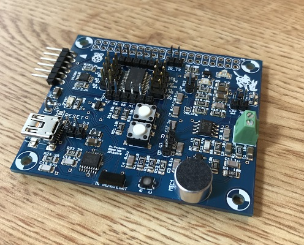
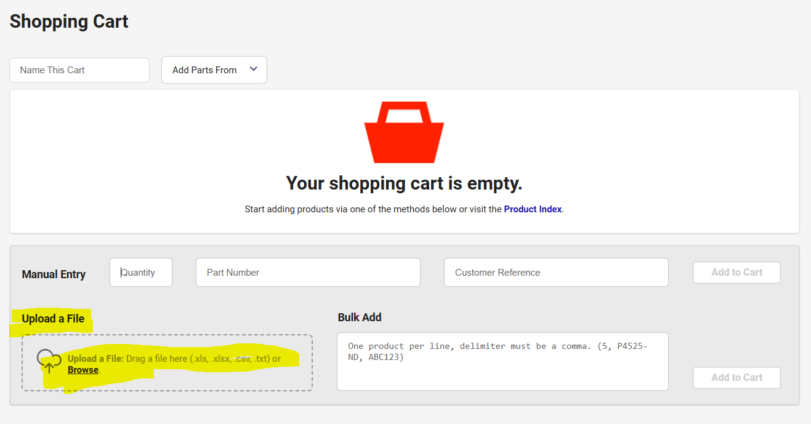
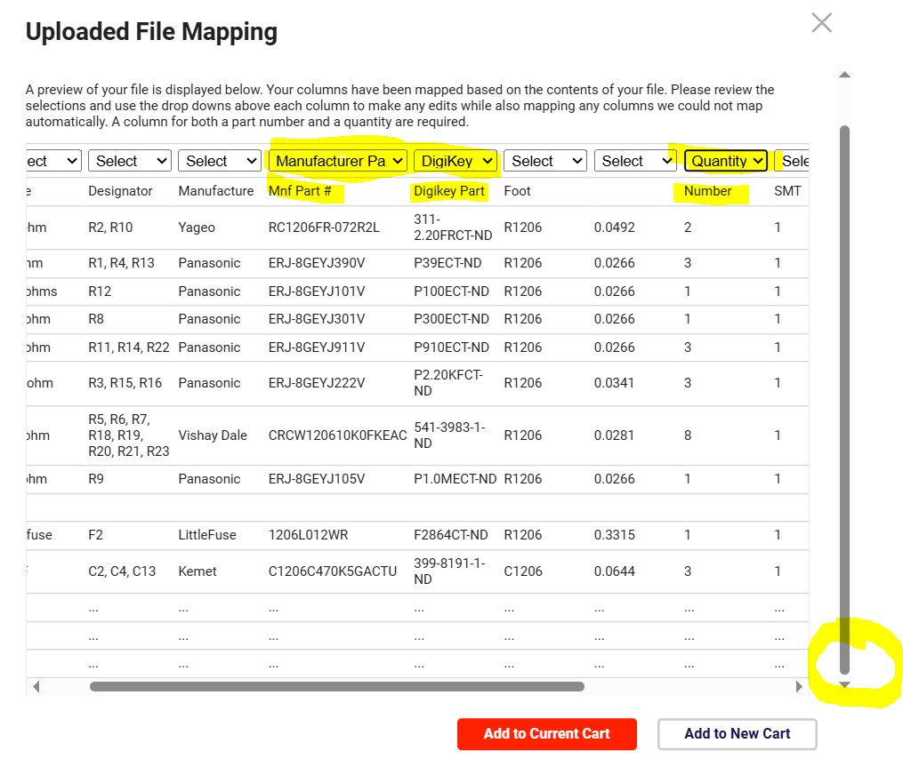

# Ordering Process for Development Boards

This file outlines a procedure to order development boards from [PCBWay](https://www.pcbway.com/).  

## Step 1: Verify BOM thhrough Digikey
You will be providing PCBWay with the bill of materials (BOM) using parts
found on Digikey.  It is possible that the parts in the existing 
[BOM](https://github.com/coulston/Embedded-Systems-Instructor/blob/main/Manufacturing%20Files/devBoard%20BOM%20PCBWay.xlsx) 
contains parts that are out of stock or have become obselete
since the last order.  Resolving these issues before sending the BOM to 
PCBWay will eliminate a lot of back-and-forth.

1. Login to [DigiKey](https://www.digikey.com/).
2. Start a new cart by clicking on the cart icon in the upper right corner of the web page.
3. Upload the
[BOM](https://github.com/coulston/Embedded-Systems-Instructor/blob/main/Manufacturing%20Files/devBoard%20BOM%20PCBWay.xlsx)
file via drag-and-drop of browse for BOM.

4. In the Upload File Mapping pop-up ensure that the manufacturer part number and DigiKey part number pull-downs
are selecting the correct columns of the BOM as shown in the following image.  Not as important, you may want
to select qualtity in the shown column.  In order to scoll horziontally, you will need to first scroll to the
bottom of the window using the control in the right side of the window.  Click on the Add to Current Cart
button when yoy have verified these selections.

   
6. If there are any issues, they will appear in the shooping cart as errors.

   
7. If you have obselete parts as shown, you will need to find a suitable replacement
   part from Digikey.  you must ensure that the replacement part has the same footprint, pinout and
   performs the same function as the obselete part.  Since Digikey keeps the technical documents for
   obselete parts, you should be able to get all the needed technical information
   to start this process.

## Step 2: Order from PCBWay

1. L
