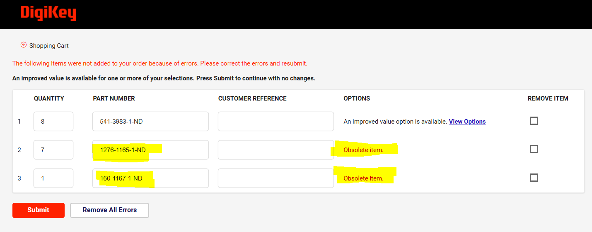
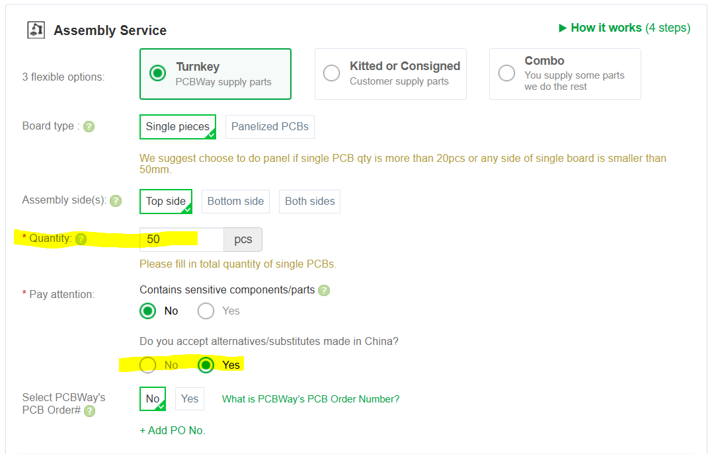
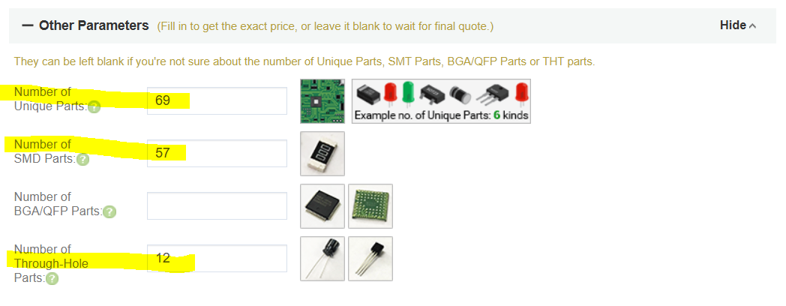
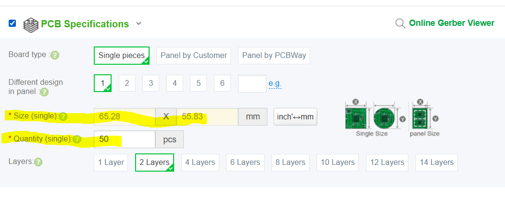
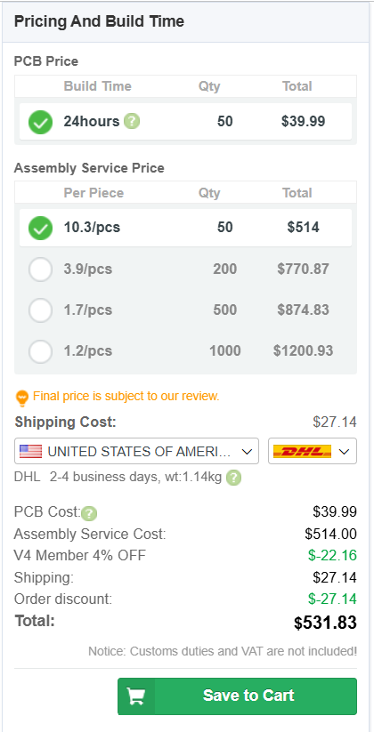

# Ordering Process for Development Boards

This file outlines a procedure to order development boards from [PCBWay](https://www.pcbway.com/).  
>[!NOTE] 
>These instructions referece manufacturer web pages that are not under my control.  As a 
result the web interfaces may be modified changing the look and feel of the interface.  In this
event, you will need to adapt the instructions to the current interface.

## Step 1: Verify BOM through Digikey
You will be providing PCBWay with the bill of materials (BOM) using parts
found on Digikey.  It is possible that the parts in the existing 
[BOM](https://github.com/coulston/Embedded-Systems-Instructor/blob/main/manufacture/hardware/devBoard%20BOM.xlsx) 
contains parts that are out of stock or have become obselete
since the last order.  Resolving these issues before sending the BOM to 
PCBWay will eliminate a lot of back-and-forth.

1. Login to [DigiKey](https://www.digikey.com/).
2. Start a new cart by clicking on the cart icon in the upper right corner of the web page.
3. Upload the
[BOM](https://github.com/coulston/Embedded-Systems-Instructor/blob/main/hardware/devBoard/manufacture/devBoard%20BOM.xlsx)
file via drag-and-drop of browse for BOM.

4. In the Upload File Mapping pop-up ensure that the manufacturer part number and DigiKey part number pull-downs
are selecting the correct columns of the BOM as shown in the following image.  Not as important, you may want
to select qualtity in the shown column.  In order to scoll horziontally, you will need to first scroll to the
bottom of the window using the control in the right side of the window.  Click on the Add to Current Cart
button when yoy have verified these selections.

   
5. If there are any issues, they will appear in the shooping cart as errors.

   
6. If you have obselete parts as shown, you will need to find a suitable replacement
   part from Digikey.  you must ensure that the replacement part has the same footprint, pinout and
   performs the same function as the obselete part.  Since Digikey keeps the technical documents for
   obselete parts, you should be able to get all the needed technical information
   to start this process.

## Step 2: Order from PCBWay

1. Login to [PCBWay](https://www.pcbway.com/).
2. Click on the PCB Assembly icon at the top of the page
3. In the **Assembly Service** area:
   - Quantity: Whatever you need, in this case 50.
   - Do you accept alternatives/substitutes made in China?  Yes
   

4. Expand **Other Parameters options**. Fill in the text boxes with the values shown below.
   
   
5. Expand **PCB Specifications options**.  Fill in the text boxes with the values shown below.
   - Size: 65.28mm x 55.83mm
   - Quantity: Match quantity in step 3.
   - Leave all the following options alone.
   

6. Scroll to the bottom of the page and click calculate
7. The right side of the web page will update the cost.
   - Click **Save To Cart**
   - Agree to the Special Notes
   

8.In the upload files pop-up
>[!NOTE] 
>The files are at the links provided.  Download the files to your local machine by clicking on the download raw file
>icon  in the upper right of the window.
- Click **Upload Gerber file** and upload. 
  [Gerber zip](https://github.com/coulston/Embedded-Systems-Instructor/blob/main/hardware/devBoard/manufacture/devBoard.zip)
- Click **Part List (BOM) Upload** and upload
  [BOM excel](https://github.com/coulston/Embedded-Systems-Instructor/blob/main/hardware/devBoard/manufacture/devBoard%20BOM.xlsx)
- Click **Upload Centroid File** and upload
  [Centroid excel](https://github.com/coulston/Embedded-Systems-Instructor/blob/main/hardware/devBoard/manufacture/devBoard%20CPL.xlsx)
- 

9. Click Submitt Order Now
10. You should hear back from the PCBWay engineers in 48 hours.

## Step 3: SD Card Holder
As ordered, the development boards do not come with the SD Cards because they are mounted to the bottom of the 
board. Hence, these have to be ordred and hand soldered using the following instructions.
1. Order 1 SD Card holder fro each development board from [DigiKey] (http://www.digikey.com) part number WM12834CT-ND
2. Solder the SD card holder
- Solder the 9 pins
- Solder the 4 mounting tabs (essential)

  
